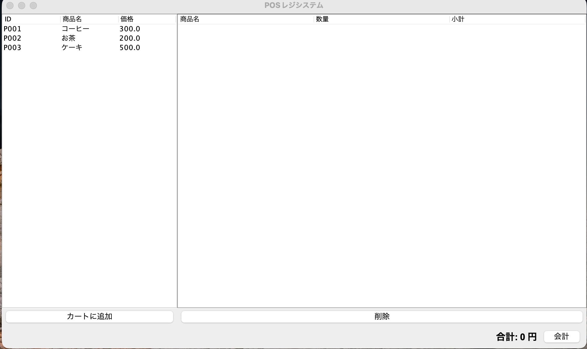
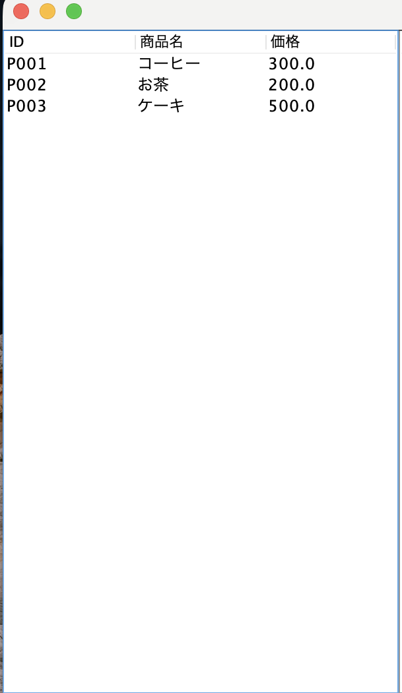
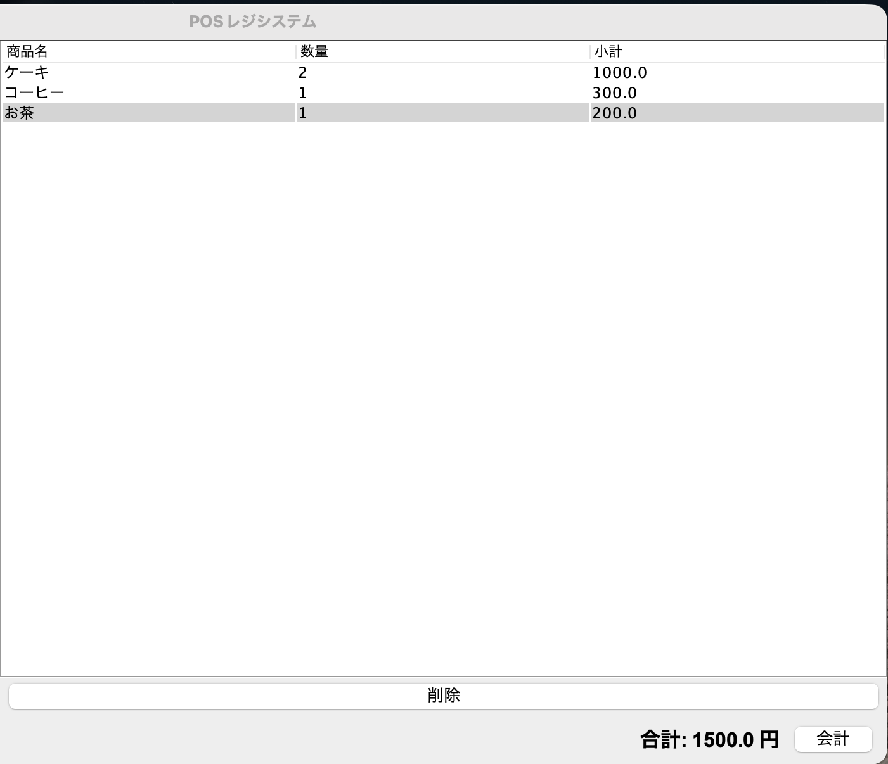

# 🧾 POSレジシステム（Java + Swing + CSV）

## 📌 概要（Overview）

このプロジェクトは、Java SE と Swing を使用して開発したシンプルなPOSレジシステムです。
データベースの代わりにCSVファイルを使用して、商品管理と注文保存を行います。

This is a simple POS (Point of Sale) system built using Java Swing.
It uses CSV files instead of a database to manage products and orders.

---

## 🚀 機能（Features）

* 🛒 商品一覧表示（JTable）
* ➕ カートに追加
* 🔢 同一商品の数量自動更新（マージ機能）
* 🗑 商品削除
* 💰 合計金額計算
* 💾 注文データをCSVに保存
* 🕒 注文日時の記録

---

## 🖥️ 画面構成（UI Layout）

```
-------------------------------------
| 商品一覧 |        カート           |
|         |                        |
|         |                        |
-------------------------------------
|   合計: XXXX円       [会計]        |
-------------------------------------
```

---

## 📂 プロジェクト構成

```
pos-system/
├── src/
│   ├── model/
│   ├── view/
│   ├── controller/
│   ├── service/
│   └── util/
├── data/
│   ├── products.csv
│   └── orders.csv
└── README.md
└── data/
```

---

## 🧠 アーキテクチャ（Architecture）

MVCパターンを使用しています：

* Model → データ構造（Product, Order）
* View → UI（Swing）
* Controller → イベント処理
* Service → ビジネスロジック

```
View → Controller → Service → CSV
```

---

## 📊 CSVファイル仕様

### products.csv

```
P001,コーヒー,300
P002,お茶,200
P003,ケーキ,500
```

### orders.csv

```
O001,コーヒー,1,300.0,2026-04-20 22:35:14
O001,ケーキ,2,1000.0,2026-04-20 22:35:14
```

---

## 🛠 使用技術（Tech Stack）

* Java SE
* Swing (GUI)
* File I/O (CSV)
* MVC設計

---

## ▶️ 実行方法（How to Run）

1. プロジェクトをクローン

```
git clone https://github.com/your-username/pos-system.git
```

2. IDE（IntelliJ / Eclipse / VS Code）で開く

3. `App.java` を実行

---

## 📸 スクリーンショット（Screenshots）

### Main Screen


### Product Screen 


### Cart Screen 


---

## 🎯 学んだこと（What I Learned）

* Java SwingによるGUI開発
* MVCアーキテクチャ設計
* CSVファイルによるデータ管理
* イベント駆動プログラミング
* クリーンコード設計

---

## 🔮 今後の改善（Future Improvements）

* SQLiteデータベース導入
* 商品検索機能
* 支払い機能（現金・クレジット）
* レシート印刷機能
* Spring Bootへの移行

---

## 👤 作者（Author）

* 名前: ZAW MOE WAI(ゾーモーウェイ)
* 目標: バックエンドエンジニア
* 　　:システムエンジニア（日本で就職）

---

## 💬 コメント

現在はCSVでデータを管理していますが、
将来的にはSQLiteやMySQLに移行する予定です。

---

⭐ If you like this project, please give it a star!
